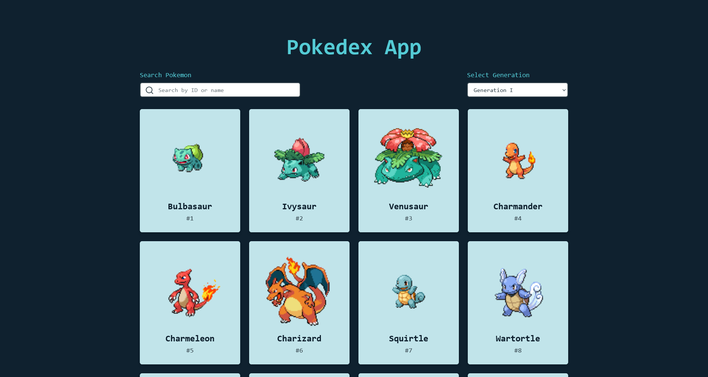
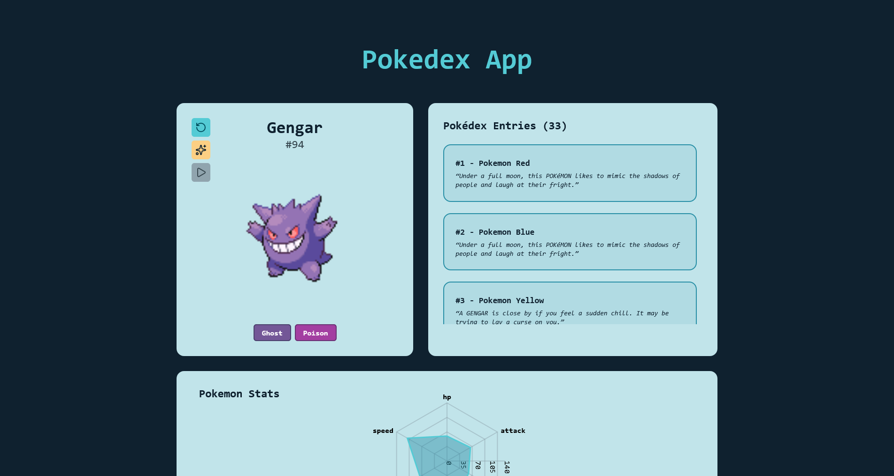

# Pokédex React App

A Pokédex web application built with React, powered by the Pokémon API, and navigated using TanStack Router.  
It allows you to explore Pokémon data, view details such as types, stats, and flavor text entries.

---

## Features

- **Browse Pokémon** — Fetch and list Pokémon using the [Pokémon API](https://pokeapi.co/).  
- **Search** — Quickly find any Pokémon by name or ID.  
- **Details** — Display Pokémon sprites, cries, stats, types, and entries.  
- **Routing** — Uses [TanStack Router](https://tanstack.com/router) for type-safe navigation.  
- **UI** — Styled with [Tailwind CSS](https://tailwindcss.com/).  

---

## Installation

```bash
# Clone the repository
git clone https://github.com/ariel-salgado/pokedex-react.git
cd pokedex-react

# Install dependencies
pnpm install

# Start the development server
pnpm run dev
```

## Screenshots



